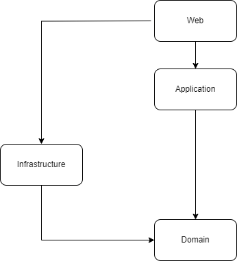

# NTierArchitectureTemplate

NTierArchitectureTemplate is a .NET Core template that provides a starting point for building modular and scalable applications using the N-tier architecture pattern. The template is designed to be flexible and extensible, allowing developers to easily add new features and functionality as their application grows.

## Overview

The template includes five main components:

- **NTierArchitectureTemplate.Domain**: This project contains the core domain entities, exceptions and services for the application. It includes interfaces for IO operations and database persistence following the repository pattern along with specifications pattern. It includes entities that is used in authentication and authorization in the identity framework by default.

- **NTierArchitectureTemplate.Infrastructure**: This project contains the implementation of the repositories, services, and interfaces defined in the domain project. It also includes the database context and entity configurations along with an extension method to setup the database context for use in the web project.

- **NTierArchitectureTemplate.Application**: This project contains the application logic and the communication between the presentation layer and the domain layer.

- **NTierArchitectureTemplate.Common**: This project contains the dtos and extension methods that is used for conversion back and forth between entity types and dtos.

- **NTierArchitectureTemplate.Web**: This project contains the presentation layer of the application, which is built using ASP.NET Core Web API.

## Preconfigured With The Template:

- Serilog
    * Logs to console and file which is saved in web project
    * Configurations is in appsettings.json
- AspNetCore Identity 
    * Default identity entities are configured: User, Role ..etc
    * A token provider is configured for creating a JWT and a Refresh Token
    * Token configurations is in appsettings.json under the name of JWT
    * JWT and Cookie Authentication policies are created to allow both authentication methods
    * Extension method AddPolicies to create authorization policies
- Autofac
    * Configured as the DI container
    * Each project has its own module where the dependencies are registered
- FluentValidation
    * Configured to register validators in application project
- Swagger
    * JWT authentication
    * Newtonsoft 
- Newtonsoft
    * Enums are converted to strings
- Web
    * MVC
    * Razor Pages
- EntityFramework Core
    * Uses sqlserver by default, the connection string is under the name SqlServer in appsettings.json
    * Uses DbContextPool
    * Migrations are saved in web project
    * Query splitting behavior is used as default
- ExtCore Storage
    * configured to wwwroot/uploadedfiles
- MediatR
    * configured for dependency injection in ApplicationModule

## Installed Nuget Packages
- [Serilog](https://www.nuget.org/packages/serilog/)
- [Serilog.AspNetCore](https://www.nuget.org/packages/Serilog.AspNetCore)
- [Serilog.Sinks.File](https://www.nuget.org/packages/Serilog.Sinks.File/5.0.1-dev-00947)
- [Serilog.Sinks.Console](https://www.nuget.org/packages/Serilog.Sinks.Console/4.1.1-dev-00910)
- [Serilog.Sinks.ApplicationInsights](https://www.nuget.org/packages/Serilog.Sinks.ApplicationInsights/4.0.1-dev-00043)
- [Swashbuckle.AspNetCore](https://www.nuget.org/packages/Swashbuckle.AspNetCore)
- [Swashbuckle.AspNetCore.Annotations](https://www.nuget.org/packages/Swashbuckle.AspNetCore.Annotations)
- [Swashbuckle.AspNetCore.Newtonsoft](https://www.nuget.org/packages/Swashbuckle.AspNetCore.Newtonsoft)
- [Ardalis.ApiEndpoints](https://www.nuget.org/packages/Ardalis.ApiEndpoints)
- [Ardalis.ListStartupServices](https://www.nuget.org/packages/Ardalis.ListStartupServices)
- [Ardalis.Specification.EntityFrameworkCore](https://www.nuget.org/packages/Ardalis.Specification.EntityFrameworkCore)
- [Ardalis.Specification](https://www.nuget.org/packages/Ardalis.Specification)
- [FluentValidation.AspNetCore](https://www.nuget.org/packages/FluentValidation.AspNetCore)
- [FluentValidation](https://www.nuget.org/packages/FluentValidation)
- [Microsoft.AspNetCore.Authentication.JwtBearer](https://www.nuget.org/packages/Microsoft.AspNetCore.Authentication.JwtBearer/8.0.0-preview.4.23260.4)
- [Microsoft.AspNetCore.Mvc.NewtonsoftJson](https://www.nuget.org/packages/Microsoft.AspNetCore.Mvc.NewtonsoftJson/8.0.0-preview.4.23260.4)
- [Microsoft.EntityFrameworkCore.Tools](https://www.nuget.org/packages/Microsoft.EntityFrameworkCore.Tools/8.0.0-preview.4.23259.3)
- [Microsoft.EntityFrameworkCore](https://www.nuget.org/packages/Microsoft.EntityFrameworkCore/8.0.0-preview.4.23259.3)
- [Microsoft.EntityFrameworkCore.SqlServer](https://www.nuget.org/packages/Microsoft.EntityFrameworkCore.SqlServer/8.0.0-preview.4.23259.3)
- [Microsoft.AspNetCore.Identity.EntityFrameworkCore](https://www.nuget.org/packages/Microsoft.AspNetCore.Identity.EntityFrameworkCore/8.0.0-preview.4.23260.4)
- [Autofac](https://www.nuget.org/packages/Autofac)
- [Autofac.Extensions.DependencyInjection](https://www.nuget.org/packages/Autofac.Extensions.DependencyInjection)
- [ExtCore.FileStorage.FileSystem](https://www.nuget.org/packages/ExtCore.FileStorage.FileSystem)
- [ExtCore.FileStorage.Abstractions](https://www.nuget.org/packages/ExtCore.FileStorage.Abstractions)
- [LanguageExt.Core](https://www.nuget.org/packages/LanguageExt.Core)
- [MediatR](https://www.nuget.org/packages/MediatR)
- [MediatR.Extensions.Autofac.DependencyInjection](https://www.nuget.org/packages/MediatR.Extensions.Autofac.DependencyInjection)

    

## Architecture

The NTierArchitectureTemplate follows the N-tier architecture pattern, which is an architecture pattern that separates an application into logical layers.

The layers in the NTierArchitectureTemplate are:

- **Presentation Layer**: This layer is responsible for handling user interface (UI) logic. The presentation layer in this architecture is implemented using ASP.NET Core Web API, which exposes a set of RESTful endpoints that clients can interact with.

- **Application Layer**: This layer is responsible for handling application logic. It acts as a mediator between the presentation layer and the domain layer. 

- **Domain Layer**: This layer is responsible for handling domain-specific logic. It contains entities, value objects, aggregates, and other domain-specific concepts.

- **Infrastructure Layer**: This layer is responsible for providing infrastructure-related services, such as data access, IO operations. The infrastructure layer in this architecture is implemented using Entity Framework Core for data access

<p align="center">
  
</p>

## Getting Started

To get started with the NTierArchitectureTemplate, you can either clone the repository or download the source code as a ZIP archive.

### Installation

1. Clone the repository or download the source code as a ZIP archive.
2. On the projects directory enter the following cli command to install the template
``` powershell
dotnet new install . 
```

### Usage
1. Type the following cli command to create a new project using the template
``` powershell
dotnet new customized-n-tier -o YourProjectName
```


## Contributing

Contributions are always welcome! If you'd like to contribute to the NTierArchitectureTemplate, please create a pull request with your changes or request a feature to be added in the future.